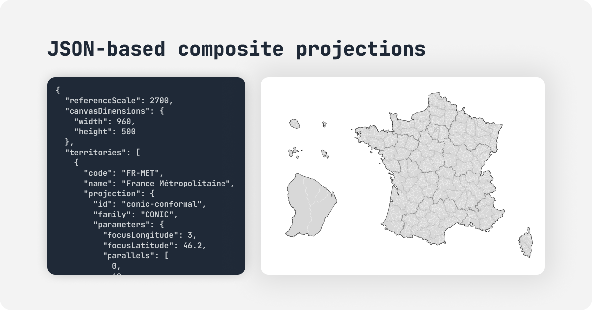

# Atlas Composer

> Interactive web application for creating custom cartographic visualizations using composite map projections

<p align="center">
  
</p>

[](LICENSE)


**Atlas Composer** consists of an interactive editor application and a set of libraries to render complex composite projections (e.g., showing France with its overseas territories in a compact view).

## App

The [Atlas Composer Editor](shallowred.github.io/atlas-composer) is a visual tool to:
- **Visualize** multi-atlas presets (France, USA, Europe, etc).
- **Customize** projections with real-time feedback.
- **Edit** territory placement and view modes (Composite, Split, Unified).
- **Export** production-ready code or JSON data.

### Local development

To run the editor locally:

```bash
# Install dependencies
pnpm install

# Prepare map data (Natural Earth)
pnpm run geodata:prepare

# Start the dev server
pnpm run dev
```

Visit `http://localhost:5173` to start editing.

## Ecosystem

Atlas Composer is organized as a monorepo. While the application is the visual interface, the core logic is available as standalone packages for your own projects.

| Package | Description |
|---------|-------------|
| [**@atlas-composer/projection-loader**](./packages/projection-loader/) | **Runtime.** The official library to load and render exported maps in your applications. Lightweight and zero-dependency. |
| [**@atlas-composer/preset-library**](./packages/preset-library/) | **Data.** A curated collection of standard map presets (e.g. `france-standard`, `usa-albers`). |
| [**@atlas-composer/specification**](./packages/specification/) | **Contract.** JSON Schemas and TypeScript definitions defining the map configuration format. |
| [**@atlas-composer/projection-core**](./packages/projection-core/) | **Engine.** Low-level D3 stream utilities and projection composition logic. |

## Documentation

For detailed technical documentation, please refer to the `./docs` directory:

- [**Architecture Overview**](./docs/architecture.md) - System design and core concepts.
- [**Atlases**](./docs/atlases.md) - How atlases are structured.
- [**Projections**](./docs/projections.md) - Details on the projection system.
- [**Vue Architecture**](./docs/vue-architecture.md) - Frontend application structure.

## Acknowledgments

This project builds upon the pioneering work of:

- **[D3.js / d3-geo](https://github.com/d3/d3-geo)** by [Mike Bostock](https://github.com/mbostock) — The stream multiplexing approach and composite projection architecture are derived from the `geoAlbersUsa` implementation.
- **[d3-composite-projections](https://github.com/rveciana/d3-composite-projections)** by [Roger Veciana](https://github.com/rveciana) — Inspiration for extending the composite projection pattern to multiple countries.

See [THIRD-PARTY-LICENSES.md](./THIRD-PARTY-LICENSES.md) for full license details.

## License

MIT © [ShallowRed](https://github.com/ShallowRed)
